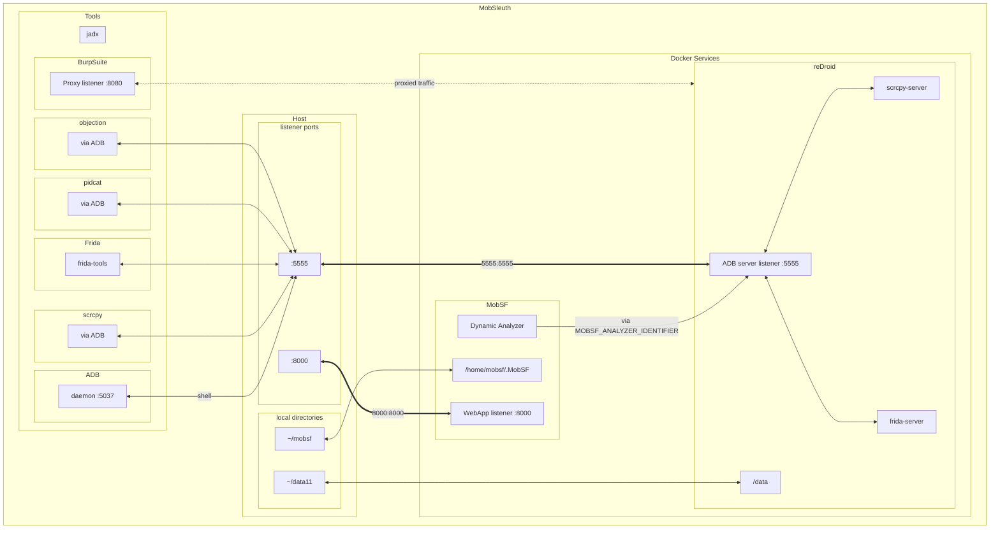

# MobSleuth 📲

> Scripts to set up your own mobile 📱 app hacking lab (currently focusing on Android)

Includes the following tools:

- [MobSF](https://github.com/MobSF/Mobile-Security-Framework-MobSF) `FOSS` - Mobile Security Framework is an open-source, automated mobile app security testing tool.
- [reDroid](https://github.com/remote-android/redroid-doc) `FOSS` - Remote anDroid solution for emulating an Android device in a container.
- [Scrcpy](https://github.com/Genymobile/scrcpy) `FOSS` - a free and open-source tool that allows you to mirror and control your Android device from your computer via ADB.
- [Frida](https://github.com/frida/frida) `FOSS` - Dynamic instrumentation toolkit for developers, reverse-engineers, and security researchers.
- [Jadx](https://github.com/skylot/jadx) `FOSS` - Dex to Java decompiler.
- [Objection](https://github.com/sensepost/objection) `FOSS` - Runtime Mobile Exploration.
- [Pidcat](https://github.com/JakeWharton/pidcat) `FOSS` - Colored logcat script which only shows log entries for a specific application package.
- [BurpSuite CE](https://portswigger.net/burp/documentation/desktop/getting-started) `proprietary` - Powerful web application security testing platform with interception, scanning, fuzzing, and more.

## Setup a VM - Lubuntu-22.04

- [Download Lubuntu](https://lubuntu.me/downloads/) or any Ubuntu based distro.
- Use [Lubuntu Installation Guide](https://manual.lubuntu.me/stable/1/1.3/installation.html) to install a VM in Virtualbox.
- Make sure you configure sufficient resources for lab to run smoothly.
  - Minimum 25GB of virtual disk space.
  - Minimum 8GB RAM allocated.
  - Mininum 4 Cores allocated.

## Install

```sh
wget -qO - https://raw.githubusercontent.com/adityatelange/MobSleuth/main/install.sh | bash
```

Tools can be installed one by one.

```sh
cd $HOME/MobSleuth/src
bash install/common_deps.sh
bash install/docker.sh
```

Logout and login again to apply group changes as we have added user to `docker` group.

Continue installing rest of the components.

```sh
cd $HOME/MobSleuth/src
bash install/redroid.sh
bash install/mobsf.sh
bash install/scrcpy.sh
bash install/frida.sh
bash install/jadx.sh
bash install/burpsuite.sh
bash install/objection.sh
bash install/pidcat.sh
```

## After Installation

- Scripts will be cloned in `~/MobSleuth/src` directory. You may update the scripts using `git pull` in this directory.
- Installers will be downloaded in `~/MobSleuth/installers` directory.
- Tools will be installed in `~/MobSleuth/tools` directory.


## Setup Diagram


