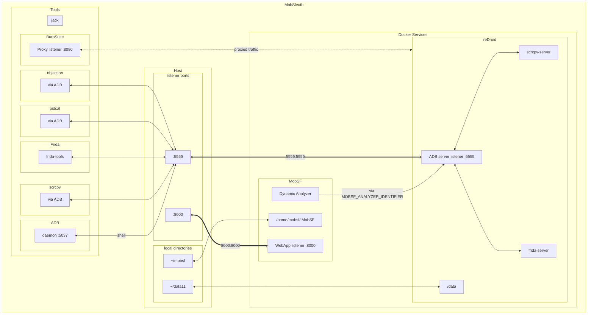

# MobSleuth 📲

> Scripts to set up your own mobile 📱 app hacking lab (currently focusing on Android)

Includes the following tools:

- [MobSF](https://github.com/MobSF/Mobile-Security-Framework-MobSF) `FOSS` - Mobile Security Framework is an open-source, automated mobile app security testing tool.
- [reDroid](https://github.com/remote-android/redroid-doc) `FOSS` - Remote anDroid solution for emulating an Android device in a container.
- [Scrcpy](https://github.com/Genymobile/scrcpy) `FOSS` - a free and open-source tool that allows you to mirror and control your Android device from your computer via ADB.
- [Frida](https://github.com/frida/frida) `FOSS` - Dynamic instrumentation toolkit for developers, reverse-engineers, and security researchers.
- [Jadx](https://github.com/skylot/jadx) `FOSS` - Dex to Java decompiler.
- [Objection](https://github.com/sensepost/objection) `FOSS` - Runtime Mobile Exploration.
- [Pidcat](https://github.com/JakeWharton/pidcat) `FOSS` - Colored logcat script which only shows log entries for a specific application package.
- [APKiD](https://github.com/rednaga/APKiD) `FOSS` - Android Application Identifier for Packers, Protectors, Obfuscators and Oddities - PEiD for Android
- [BurpSuite CE](https://portswigger.net/burp/documentation/desktop/getting-started) `proprietary` - Powerful web application security testing platform with interception, scanning, fuzzing, and more.

What you get:
- A complete setup of tools to start hacking Android apps.
- A dockerized environment to run Android apps in a container.
- One-command `root` access to the Android container.
- BurpSuite running on the host machine to intercept and modify traffic.
- Mobsf with *dynamic analysis* capabilities connected to Android container.
- ADB server running on port 5555 to connect to the Android container.
- Scrcpy to mirror and control the Android container.
- Scripts to generate a CA certificate and install them on the Android container.
- Scripts to install and run Frida on the Android container.

<kbd></kbd>


## Setup a VM - Lubuntu-22.04

- [Download Lubuntu](https://lubuntu.me/downloads/) or any Ubuntu based distro.
- Use [Lubuntu Installation Guide](https://manual.lubuntu.me/stable/1/1.3/installation.html) to install a VM in Virtualbox.
- Make sure you configure sufficient resources for lab to run smoothly.
  - Minimum 25GB of virtual disk space.
  - Minimum 8GB RAM allocated.
  - Mininum 4 Cores allocated.

## Install

> [!NOTE]  
> Below scripts might require `sudo` access to install certain packages and dependencies.
> Review the scripts before running them.

```sh
wget -qO - https://raw.githubusercontent.com/adityatelange/MobSleuth/main/install.sh | bash
```

Tools can be installed one by one.

```sh
cd $HOME/MobSleuth/src
bash install/common_deps.sh
bash install/docker.sh
```

Logout and login again to apply group changes as we have added user to `docker` group.

Continue installing rest of the components.

```sh
cd $HOME/MobSleuth/src
bash install/redroid.sh
bash install/mobsf.sh
bash install/scrcpy.sh
bash install/frida.sh
bash install/jadx.sh
bash install/burpsuite.sh
bash install/objection.sh
bash install/pidcat.sh
```

## After Installation

All the tools are installed in the `~/MobSleuth` directory.

- `~/MobSleuth/src` - contains the installation scripts. You may update MobSleuth using `git pull` in this directory.
- `~/MobSleuth/installers` - contains the downloaded installers.
- `~/MobSleuth/data11_vol` - contains the data directory for the reDroid container for persistence.
- `~/MobSleuth/mobsf_vol` - contains the data directory for the MobSF container for persistence.
- `~/MobSleuth/tools` - contains the tools installed.
- `~/MobSleuth/certs` - contains the generated CA certificate and private key.

## Usage

### Start the containers

```sh
cd $HOME/MobSleuth
bash run/run_mobsleuth_services.sh
```

This will start the following services:
- reDroid - Android container accessible on port 5555
- MobSF - Mobile Security Framework accessible on port 8000

### Generate CA certificate

```sh
cd $HOME/MobSleuth
bash scripts/generate_cert.sh
```

### Install CA certificate on the Android container

Make sure the Android container is running.

```sh
cd $HOME/MobSleuth
bash scripts/push_cert.sh
```

### Import CA certificate in BurpSuite

- Open BurpSuite and go to `Proxy` > `Proxy Settings`
- Select an Interface and click on `Edit`.
- Click on `Import / export CA Certificate`.
- Select `Certificate and private key in DER format` and click `Next`.
- In CA Certificate, select `~/MobSleuth/cert/certificate.der` and in Private key, select `~/MobSleuth/cert/certificate_private_key.der`.
- Click `Next` and `OK`.

### Set/Unset BurpSuite Proxy in the Android container

```sh
cd $HOME/MobSleuth
bash run/set_proxy.sh
```

Unset using:
    
```sh
cd $HOME/MobSleuth
bash run/unset_proxy.sh
```

### Access MobSF

Open your browser and go to `http://localhost:8000`.

### Access reDroid

Connect to the Android container using `scrcpy` or `adb`.

Mirror Screen using `scrcpy`:

```sh
scrcpy
```

Connect using `adb`:

```sh
adb connect localhost:5555
```

ADB shell:

```sh
adb shell
```

### Rooting the Android container

Make sure the Android container is running. Then run the following command.

```sh
adb root
```

### Using Frida

Push frida-server and run it on the Android container.

```sh
cd $HOME/MobSleuth
bash scripts/push_fridaserver.sh
bash scripts/run_fridaserver.sh
```

Now we can use `frida` to interact with the Android container.

```sh
frida-ps -U
```

### Access `jadx`/`objection`/`pidcat`

These tools can directly accessed using the terminal.

```sh
jadx
```

```sh
objection
```

```sh
pidcat
```

## Uninstall

This will remove all the tools and the containers. Be careful before running this command.

```sh
sudo rm -rf $HOME/MobSleuth
```

## Setup Diagram


